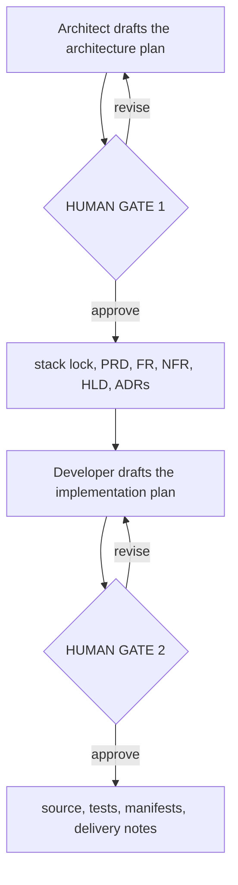
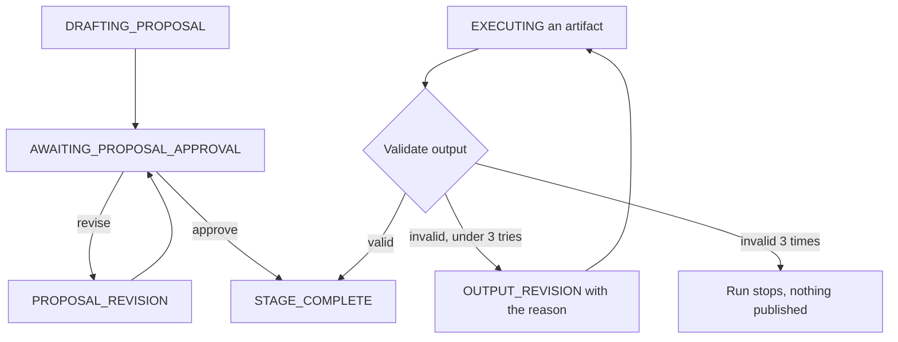

# CrewAI Engineering Factory

A three-agent factory that produces an approved architecture and modular source
from [INSTRUCTIONS.md](INSTRUCTIONS.md). Python code enforces two mandatory human
gates: the Architect's plan for the whole requirements and architecture phase, and
the Senior Developer's implementation plan. Everything between and after those gates
runs under a plan you already approved and is policed by programmatic guardrails.

## Setup and run

Use Python 3.11+ and an Anthropic account with access to the configured models.
The generated application can use a different language, including Node.js.

```powershell
py -m venv .venv
.\.venv\Scripts\python.exe -m pip install -r requirements.txt
$env:ANTHROPIC_API_KEY = "YOUR_NEW_KEY"
.\.venv\Scripts\python.exe main.py
```

Enter your key locally; do not put secrets in the brief or feedback. Previously
exposed keys should be revoked. Environment values are read at CLI startup.

Each gate shows the full plan and accepts only:

- `approve`: lock this plan and build everything it describes.
- `approve build-now`: gate 1 only - lock the plan but skip the PRD, FR, NFR, HLD,
  ADRs and tests, and build the app straight from the plan. About 76% cheaper; see
  [Build now](#build-now-skipping-the-specification-documents).
- `revise <feedback>`: retain the exact feedback and ask the same agent to replan.
  Repeat as often as you like; the gate does not move on until you approve.
- `quit`: pause; rerun the same command to resume the pending gate.

A word the gate does not offer is not an approval - `approve buildnow` is rejected
and asked again, so a typo can never be read as consent to build.

Blank input and `yes` do not approve. Ctrl+C/EOF stop without auto-approval.
Drafts and revision logs are available under `generated/memory/reviews/`.

## Delivery flow

The run stops for you twice.



1. **Gate 1 - architecture plan.** The Architect plans the whole requirements and
   architecture phase in one document: the exact language/framework/database/infra
   taken from the brief, the open choices it wants you to settle, the product scope,
   the FR and NFR it will commit to, the component design, the binding `src/` file
   tree and the ADR list. Missing values or alternatives are put to you here; there
   is no Python default. Answer with `revise <your choices>` until it is right.
2. Under that approved plan and without further prompting, the Architect locks the
   stack and writes the PRD, FR, NFR, HLD and every ADR. Each one is checked by the
   guardrails and retried with the rejection reason, up to three attempts.
3. **Gate 2 - implementation plan.** The Developer plans every module and test
   against the approved tree, with the dependencies and the commands you will run.
4. Under that approved plan the Developer emits all files in the approved tree, and
   the Manager packages the delivery with installation, test and run commands.

Each plan gate runs this loop; the artifacts after it are validated, not re-approved:



The approved plans are kept as the plan of record in `memory/02_architecture_plan.md`
and `memory/04_implementation_plan.md`. Nothing is written to `src/` until gate 2 is
approved. No optional QA agent is enabled; the team stays at three agents.

## Build now: skipping the specification documents

Answer gate 1 with `approve build-now` to go straight from the approved architecture
plan to code. Step 2 above is skipped entirely - no PRD, FR, NFR, HLD or ADR is
written - and the Developer treats the approved plan, its revision log and the brief
as the whole specification.

**No tests are generated on this path.** The architect still plans them, because the
plan is written before you choose; the controller then drops every test path from the
tree it records, and the Developer is told not to write or describe any. The drop is
deterministic rather than left to the prompt, and each dropped path is written to
`memory/04_task_log.jsonl` as a `tests_skipped` event so the delivery is honest about
what was not produced. The Developer is instead told to spend that effort on input
validation and error handling, so the app fails loudly rather than silently.

The stack lock still runs, because the locked stack and the binding file tree drive
every downstream guardrail. On this path it also transcribes the tree from the plan's
Proposed File Tree section. Every rule except the tests requirement still applies:
real paths under `src/`, no language substitution, and at least two application
modules - a single-file script is still rejected. Gate 2 still runs, so you still see
and approve the module plan before any code is written.

Measured on the Book Library brief (three agents, Sonnet 4.5 + Haiku 4.5, tokens at
4 chars each):

| Path | LLM calls | Human stops | Input tok | Output tok | Cost |
|---|---:|---:|---:|---:|---:|
| Full specification | 11 | 2 | 616K | 34K | $2.12 |
| `approve build-now` | 5 | 2 | 138K | 14K | **$0.51** |

The saving is mostly input, not output: every invocation re-sends the whole `memory/`
folder, so each document written early is paid for again on every later call.

Use the full path when the specifications are a deliverable in their own right - an
audit trail, a handover, or a spec someone signs off - or when anyone will maintain
the result. Use `build-now` for prototypes, demos and throwaway rebuilds: with no
requirements documents and no tests, the structural guardrails are the only thing
checking the output, and nothing in the delivery has been executed.

## Shared memory

Default project root: `generated/` (ignored by Git). Set `--output` for another root.

```text
generated/
  memory/
    00_brief.md
    01_prd.md
    02_architecture_plan.md      <- approved at human gate 1
    03_architecture/
      fr.md
      nfr.md
      hld.md
      tradeoffs/0001-<slug>.md
    04_implementation_plan.md    <- approved at human gate 2
    04_task_log.jsonl
    05_handoff_log.md
    06_delivery.md
    context.json
    reviews/<item>/
    reopen/
    superseded/
  src/
    <exact approved modular application tree>
```

The brief is preserved verbatim; agents ignore HTML guidance comments. Constraints
bullets, table rows and paragraphs are retained verbatim in context. Each invocation
receives a fresh snapshot of the memory folder, including audit and revision logs.
CrewAI persistent memory is disabled; there is no separate mutable context cache.
Approved decisions include artifact references, not just an agent's latest response.

Existing demo artifacts in `output/` remain untouched. Old ungated output is not
imported as approved memory. New runs use the new layout without trusting old signoffs.
The former regex-based one/two-service planner is no longer on the active code path.

## Models and project overrides

[agents.config.yaml](agents.config.yaml) configures each agent independently.
Defaults are Haiku 4.5 for Manager and Sonnet 4.5 for Architect/Developer.
Model availability depends on your Anthropic account. `model_tier` is metadata;
the explicit `model` identifier is what the invocation uses.

Resolution order: `--agents-config`, then `<project-root>/agents.config.yaml`, then
the repository configuration. There is no fallback to a shared model.

```powershell
.\.venv\Scripts\python.exe main.py --output projects/book-library --agents-config agents.config.yaml
.\.venv\Scripts\python.exe main.py --instructions INSTRUCTIONS.md --output projects/another-app
```

Use the same paths to resume. A changed brief requires a new output directory so
old approvals cannot authorize a different request. Keep custom project memory
out of Git if it contains private information.

## Reopen a decision

```powershell
.\.venv\Scripts\python.exe main.py --reopen hld --feedback "Add a persistence module and its tests."
```

The Manager must pass proposal AND output approval before reopening. Affected
downstream approvals are invalidated, old artifacts and reviews are archived under
`memory/superseded/`, and the requested stage restarts with the full feedback.
The task log stays append-only. Prior decisions are marked reopened, not erased.
Accepted targets include `architecture-plan`, `stack-lock`, `prd`, `fr`, `nfr`,
`hld`, `implementation-plan`, an ADR
name such as `0001-storage`, `development`, and `packaging`.

The controller refuses to archive files edited outside the factory. Preserve those
edits separately first. Run only one factory process per project directory; this
local controller is not a concurrent or transactional distributed job system.

## Guardrails and limitations

- Strict JSON artifacts, exact requested paths, no traversal, symlinks/junctions,
  Windows device paths or case-colliding file names.
- Exact locked-stack metadata on downstream outputs; recognized source extensions
  must match the locked language. Unknown languages stop for validator extension.
- HLD must specify at least two application modules, tests and numbered ADRs.
  Development cannot add, omit or rename files from this approved tree.
- Python source is syntax-checked, and supported Python frameworks require real
  AST imports. Common JS frameworks require their package manifest dependency.
- Invalid deliverables receive validation feedback, with at most three attempts
  per uninterrupted run before stopping. No invalid output is published.

These are structural checks, not proof of semantic stack compliance, security or
correctness. JavaScript/TypeScript and other languages are not compiled by the
factory. Database/infra choices and nuanced constraints require human review.
Agents have no shell execution tools. Tests are generated but NOT RUN; no passing
test results or production-readiness guarantee should be inferred from approval.
Review generated commands and execute tests in an appropriate isolated environment.

Full disk snapshots intentionally avoid silent context summarization. Very large
projects or long revision histories may exceed the selected model's context window
and stop; automatic lossy compaction is not enabled.

## Tests and code map

```powershell
.\.venv\Scripts\python.exe -m unittest discover -s tests -v
```

Tests use fake agent responses or mocked CrewAI kickoff; no API calls or keys are
required. They cover both plan gates, revisions, resume, reopening, per-agent models,
fresh memory, stack mismatch, path safety and an end-to-end TypeScript pipeline.

- [crew.py](crew.py): orchestration, stack lock, publication and reopening.
- [services/orchestration.py](services/orchestration.py): disk store and state machine.
- [services/guardrails.py](services/guardrails.py): structured artifact validation.
- [agents/prompts.py](agents/prompts.py): role templates and hard stack constraint.
- [agents/engineering_team.py](agents/engineering_team.py): one scoped CrewAI call per action.
- [tasks/speckit_tasks.py](tasks/speckit_tasks.py): artifact contracts and stage order.
- [templates/architecture](templates/architecture): required FR/NFR/HLD/ADR templates.

If imports fail in VS Code, select `.venv` and install requirements using that
interpreter. If a model call fails, verify model access and the key in your local
terminal; never paste the key into logs or chat.
