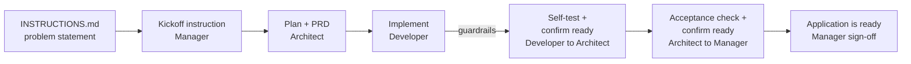

# CrewAI Engineering Factory

A multi-agent system that behaves like a **real engineering team**. A crew of
[CrewAI](https://github.com/crewAIInc/crewAI) agents runs a **manager-led
delivery loop** to turn a plain-English problem statement into a working,
guardrail-validated application.

You describe the problem in [INSTRUCTIONS.md](INSTRUCTIONS.md); the Manager
instructs the Architect, the Architect plans and hands PRD steps to the
Developer, the Developer builds + self-tests, and confirmation flows back up
the chain until the Manager announces delivery.

## How it mirrors a real engineering team

| Agent (role)         | Step                                                 | Output artifact          |
| --------------------- | ----------------------------------------------------- | ------------------------ |
| Engineering Manager   | Reads the brief, instructs the Architect               | `output/memory/kickoff.md` |
| Software Architect    | Writes the technical plan                              | `output/specs/plan.md`   |
| Software Architect    | Writes PRD build steps + acceptance criteria            | `output/specs/prd.md`    |
| Senior Developer      | Implements each service (guardrailed)                   | `output/src/app.py`, or `output/src/service-a/app.py` + `output/src/service-b/app.py` |
| Senior Developer      | Self-tests, confirms readiness to the Architect          | Test summary (console)   |
| Software Architect    | Checks acceptance criteria, confirms to the Manager       | Acceptance review (console) |
| Engineering Manager   | Confirms delivery to the stakeholder                       | "Application is ready" message + run commands (console) |

The agents run **sequentially**, each consuming the previous artifacts as
context — exactly like a manager kicking off work, an architect planning and
signing off on acceptance, and a developer building and self-testing in
between.

### One app, or two microservices — driven by `INSTRUCTIONS.md`

Before any agent runs, `services/service_planner.py` scans your brief:

- Mention **"two microservices"** (or "2 services") → the factory scaffolds
  two independent, basic services: `output/src/service-a/app.py` (port 8001)
  and `output/src/service-b/app.py` (port 8002).
- Mention **"single service"/"one application"**, or say nothing at all → the
  factory scaffolds one app at `output/src/app.py` (port 8000).

Whichever path is taken, the **Engineering Manager** agent has the final word:
it confirms *"The application is ready."* (or *"The applications are
ready."*) and prints the exact command to run each service.

## Delivery flow



## Guardrails (the Developer's output is intercepted)

Before the implementation is trusted, `services/guardrails.py` enforces:

1. **Sanitization** — strips markdown code-fence wrappers.
2. **Syntax check** — compiles the code with Python's `compile()`.
3. **Framework check** — verifies a real UI framework import
   (`streamlit` / `fastapi` / `flask`) is present.

This is wired into CrewAI as a **task guardrail**, so a failed check makes the
crew retry the implementation before anything is written to
`output/src/app.py`.

## Project structure

```
crewai-speckit-factory/
├── INSTRUCTIONS.md              # <-- write your problem statement here
├── config/settings.py          # model, API key, artifact paths
├── agents/engineering_team.py   # Manager, Architect, Developer roles
├── tasks/speckit_tasks.py       # the manager-led task pipeline (dynamic per service)
├── services/service_planner.py  # decides 1 app vs 2 microservices from the brief
├── services/guardrails.py       # sanitize + compile() + import checks
├── crew.py                      # assembles agents + tasks into a Crew
├── main.py                      # reads the brief and runs the crew
├── requirements.txt
└── output/                      # generated artifacts (created at runtime)
```

## Prerequisites

- Python 3.11 or newer
- A Claude (Anthropic) API key ([console.anthropic.com](https://console.anthropic.com/settings/keys))

## Setup

### 1. (Optional) Create a virtual environment

```powershell
python -m venv .venv
.\.venv\Scripts\Activate.ps1
```

### 2. Install dependencies

```powershell
pip install -r requirements.txt
```

### 3. Set your Claude API key

**PowerShell:**
```powershell
$env:ANTHROPIC_API_KEY = "your_api_key_here"
```

**cmd:**
```cmd
set ANTHROPIC_API_KEY=your_api_key_here
```

**bash/zsh:**
```bash
export ANTHROPIC_API_KEY="your_api_key_here"
```

The factory uses `claude-haiku-4-5-20251001` by default — Claude's smallest,
cheapest, fastest model, which is all that's needed to scaffold these basic
services. Change `model` in [config/settings.py](config/settings.py) if you
want a larger Claude model.

## Write your problem statement

Open [INSTRUCTIONS.md](INSTRUCTIONS.md) and edit the **Problem Statement**
section (and optionally the constraints / acceptance criteria). This is the
single input the engineering team works from.

## Run the factory

From this folder:

```powershell
python main.py
```

You will see each agent take its turn in the console. When finished, the
generated artifacts appear under `output/`:

- `output/memory/kickoff.md` — Manager's build instruction to the Architect
- `output/specs/plan.md` — Architect's technical plan
- `output/specs/prd.md` — Architect's PRD build steps + acceptance criteria
- `output/src/app.py` (or `output/src/service-a/app.py` + `service-b/app.py`)

## Run the generated application(s)

The Engineering Manager's final console message gives you the exact command,
but as a rule of thumb:

**Single app (Streamlit):**
```powershell
streamlit run output/src/app.py
```

**Single app (FastAPI):**
```powershell
uvicorn output.src.app:app --reload --port 8000
```

**Two microservices (FastAPI):**
```powershell
uvicorn output.src.service-a.app:app --reload --port 8001
uvicorn output.src.service-b.app:app --reload --port 8002
```

Open the URL shown in the terminal for each running service.

## Using the real Spec Kit CLI (optional)

This project follows Spec Kit's methodology programmatically. To use the
official interactive workflow with your own AI coding agent instead:

```powershell
uv tool install specify-cli --from git+https://github.com/github/spec-kit.git
specify init my-project --integration copilot
```

Then drive it with `/speckit.constitution`, `/speckit.specify`, `/speckit.plan`,
`/speckit.tasks`, `/speckit.implement`, and `/speckit.converge`.

## Configuration

Settings live in [config/settings.py](config/settings.py):

| Setting       | Default                                | Description                          |
| ------------- | --------------------------------------- | ------------------------------------- |
| `model`       | `anthropic/claude-haiku-4-5-20251001`   | Claude model (LiteLLM id) for agents  |
| `temperature` | `0.4`                                    | Sampling temperature                 |

## Troubleshooting

- **`ANTHROPIC_API_KEY is not set`** — export it in the same shell before running.
- **Guardrail retries / block** — the model produced invalid Python or omitted a
  web framework import; CrewAI retries the implement task automatically.
- **`ModuleNotFoundError: crewai`** — install dependencies and activate your venv.
