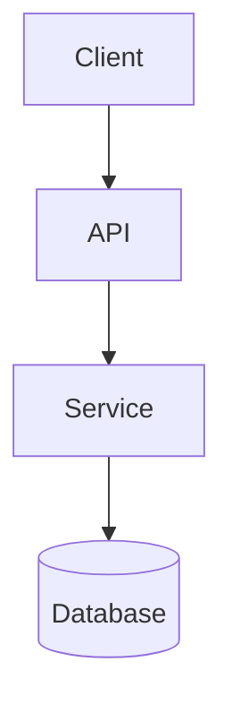

# High-Level Design

## Component Diagram

```mermaid
graph TD
  Client --> API
  API --> Service
  Service --> DB[(Database)]
```

## Module / File Tree
(proposed src/ layout — see §5)

## Key Flows
(sequence diagrams for the 2-3 most important flows)